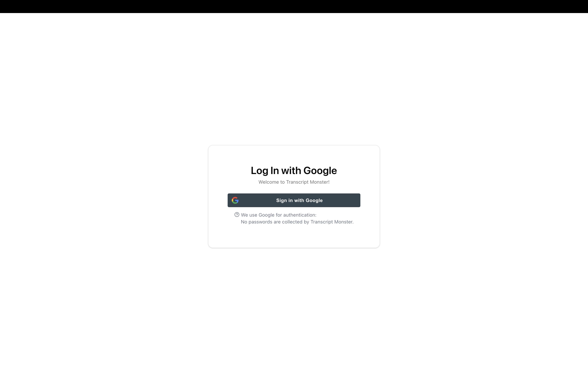
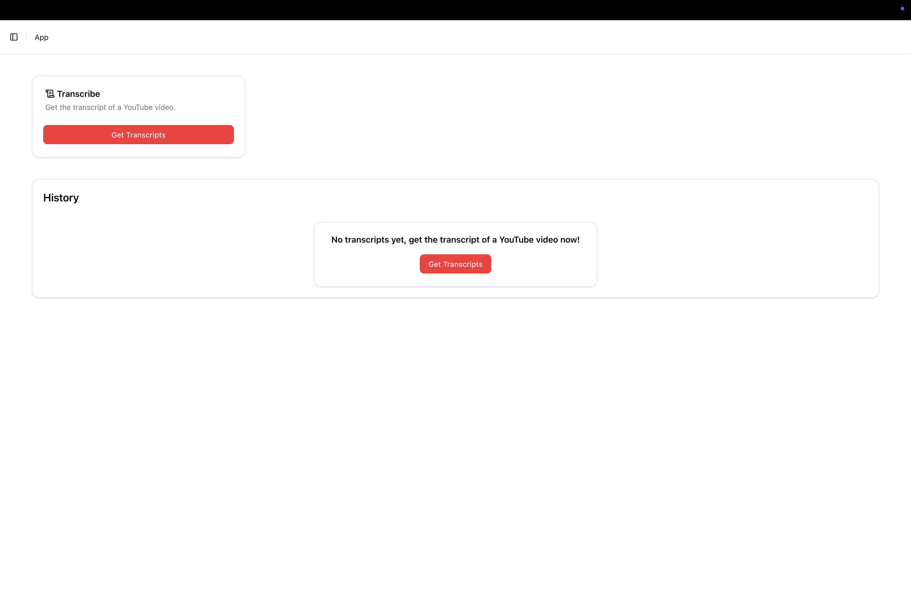
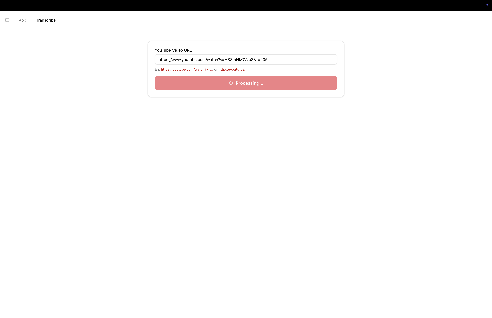
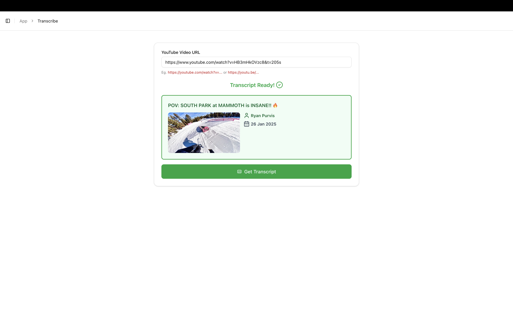
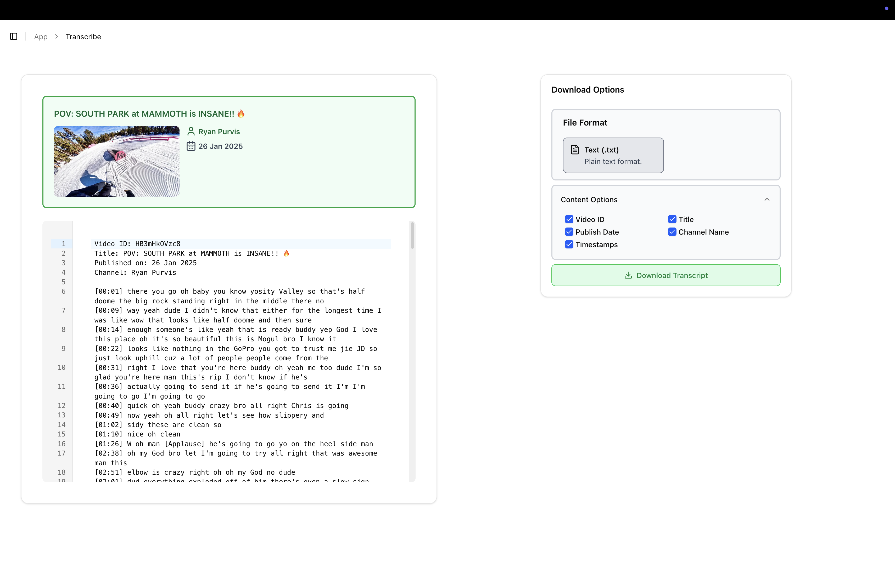
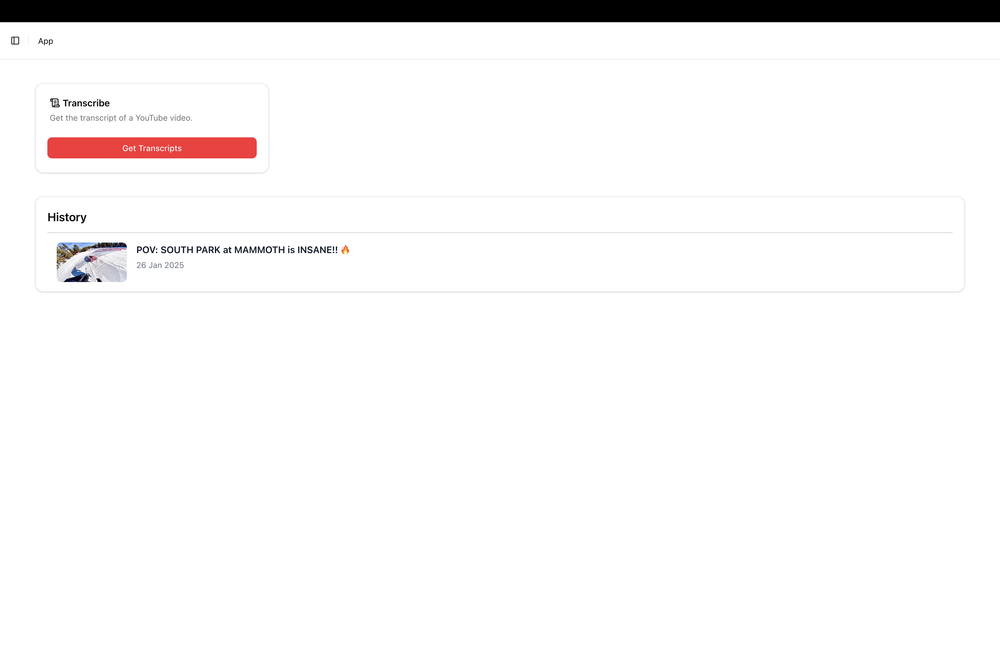

# Transcript Monster v1

A full-stack web application that extracts YouTube video transcripts and allows users to download them.

## Tech Stack

- **Frontend:** Next.js, React, Tailwind CSS  
- **Backend / Database:** Supabase  
- **Authentication:** Google OAuth with Supabase Auth (OAuth 2.0)

## Key Takeaways

This project helped me learn and apply core full-stack development concepts, including:

- Building custom UI components with shadcn
- Making and handling API requests
- Designing systems that handle relational data
- Applying type safety and type checking
- Implementing authentication using Google OAuth (OAuth 2.0)

## App Overview

### User Flow:

User signs in with Google

Homepage

User pastes YouTube link to fetch transcript

Transcript fetched!

Preview and customise transcript options for downloading

Homepage now shows history of video transcripts fetched!

(Click each history item to open the transcript preview page)

## Potential Improvements

1. Add more filetypes options for download
2. Integrated chat function with video player and LLM
